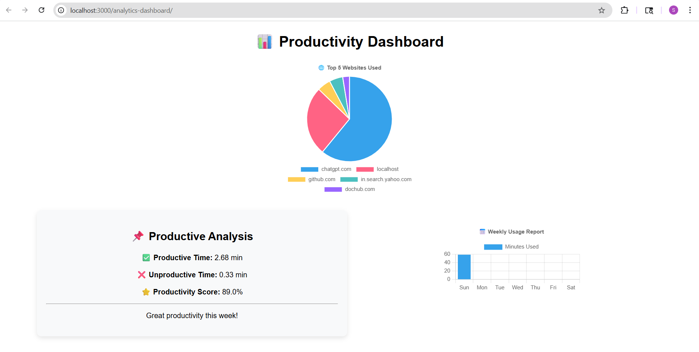
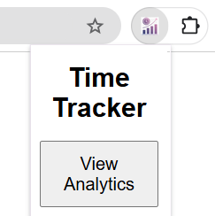

📊 Time Tracker & Productivity Analytics (Chrome Extension)

A Chrome Extension that tracks the time spent on different websites and provides productivity analytics. 
It helps users understand their browsing habits and improve productivity by classifying websites as productive or unproductive.

🚀 Features : 
⏱️ Tracks time spent on each website
📊 Classifies websites as: Productive (e.g., coding platforms) Unproductive (e.g., social media) 
📅 Weekly productivity reports (planned/expandable) 
💾 Stores user data locally / backend ready 
📈 Analytics dashboard (backend integration supported) 
⚡ Lightweight Chrome extension using Manifest V3

🧰 Tech Stack :  
HTML, CSS, 
JavaScript 
Chrome Extension API (Manifest V3) 
Node.js (for backend - optional)
Express.js (API server)
MongoDB (for storing user analytics)

## Screenshots

### Dashboard

### Extension

